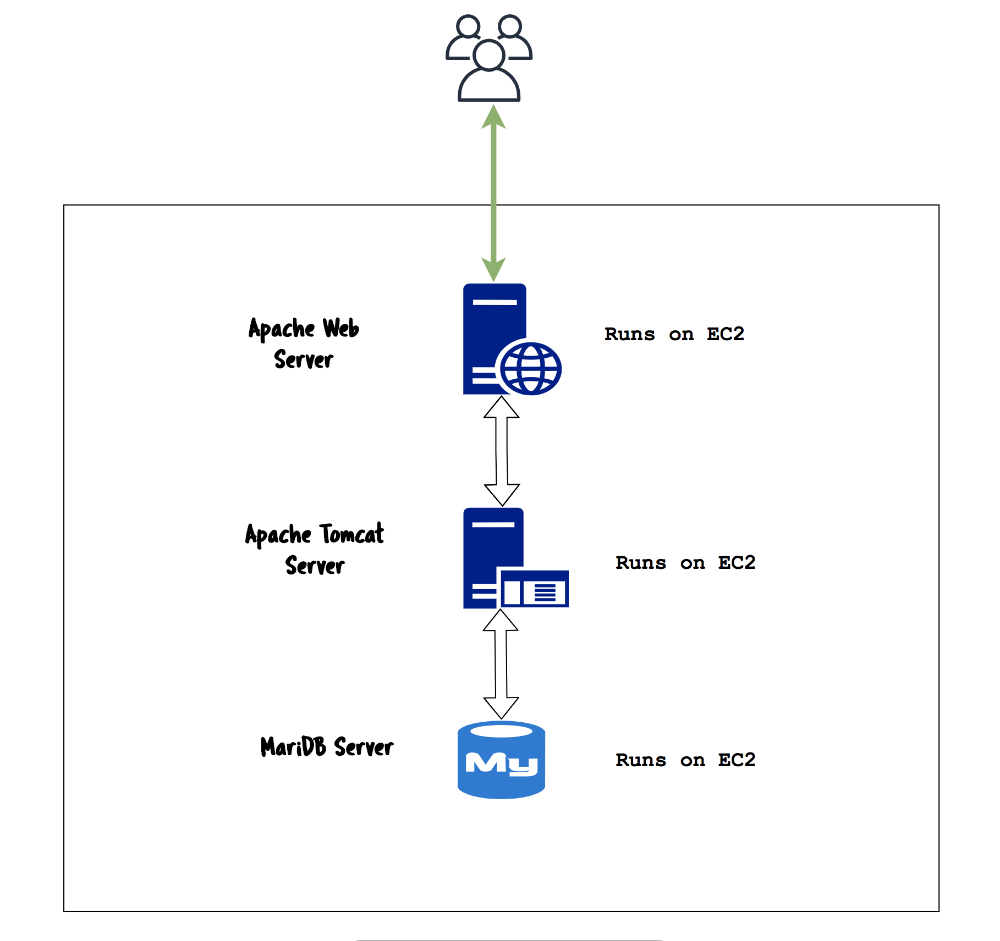

# Application Anatomy

An educational institution want to transform their process of admissions from manual paperwork to an application they can use online.

So for their requirement they have contacted IT Director (Bob) to make this application created and get it done as per their requirements. Bob recruited couple of developers (John and Jim) to start work on these requirements. John and Jim collaboratively understood the business requirements and they wanted to start the application development and they have chosen Java is best for this and they chosen Maven as Project Build tool and started the development using Agile Methodology.

First version of application has been delivered by Jim and John to Bob and they had some reviews modifications and finally they are ready with product. Now Bob want to run this application 24/7. He has calculated that running servers in his company environment is not viable and wanted to go with any cloud vendor to reduce the burden which has to avoid recruiting some more people to run infrastructure. 

Bob went to different cloud vendors and their quotations , he decided to go with Amazon Web Services as it suits more of his requirements in terms of cost and management. He signed with AWS and he got the required capacity to run the infrastructure for the application. Bob want an engineer who wants to can take care the cloud based automation as well as continuous delivery of the application. So he choose to recruit a DevOps engineer.

So now you as a DevOps engineer you need to take care of the efforts.

*  Supporting Agile Development and make necessary automation to deliver the application in CD/CD manner.
*  Ensure running the application 24/7 and also application met the capacity requirements (TPS).
*  Bob has given you free hand to use the tools of your choice to get this complete process standardized.
*  You need to review the complete requirements and finalize what are the tools can be used to standardized automation for this complete requirements.

Firstly you approached Jim and John and tried to understand the architecture of application.

As per their view the application looks like as follows.

Following are the observations of yourself from the application architecture

*  It is just a three layered application. Typically have three layers.
*  Developer already running the application in AWS environment in test account.
*  Developer choose the application to be written in Java as they want to use Tomcat Application Server.
*  Developer wanted to proxy this application through the web server as they have some static content to be delivered and also they want to make some redirect rules in future for application.
*  Also as of now Developer want to keep this data in SQL DB and he chooses MariaDB. Yet they have plans to explore MongoDB and PostgreSQL in future for this application.
*  Developer also used SpringBoot for this application and they had a vision to deliver this application as service.

So you want to understand the technical configurations of application hence you are referred to use the developer documentation to setup and application. Now your task is to setup the application by referring the following documentation.

[Click here for application Configuration on servers, Only EC2](https://gitlab.com/batch36/project-documents/blob/master/components-on-servers.md)

Now as per the application architecture you need to design the infrastructure components. As Bob has already taken the stand on moving to AWS now we are going to use AWS to deploy this application.

Firstly as a initial kickoff you need to deploy the application and all its components on the servers instead of services in AWS. All you can use is EC2 service in AWS.

Once after your review of application and its components it is your responsibility to deliver the application using different services in AWS.

[Click here for application Configuration using AWS Services](https://gitlab.com/batch36/project-documents/blob/master/components-of-aws.md)

-------

Assume that you have done the review and proposed the following tools can be used in complete deployment of application from end to end in automated manner.

Following tools for Continuous Integration

* Git for Code Management. GitLab for UI tool of Git. 
* SonarQube for Code Quality 
* Sonatype Nexus for Artifact Management.
* 

